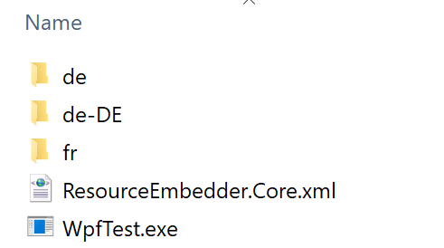
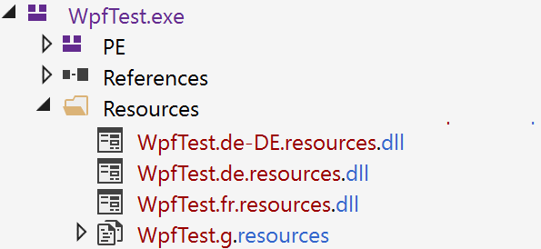

# Automatically embeds satellite assemblies into the main assembly

Compatible with .Net Standard 2.0 and .Net 4.6 and above.

# NuGet references

[Resource.Embedder](https://www.nuget.org/packages/Resource.Embedder/) 

By adding the NuGet package to an assembly all it's satellite assemblies will automatically be embedded as resources and loaded from there.
**Each assembly with localization files needs to reference the embedder package!**

[Resource.Embedder.Core](https://www.nuget.org/packages/Resource.Embedder.Core/) 

Only use the Core package if you want to [manually inject resources](docs/Core%20package%20usage.md)!

## How it works

Before: Localization files (`<Exe name>.resources.dll`) are in seperate folders per language:

After adding the nuget and recompiling: No more seperate files, all localization resources are embedded into exe/dll and are loaded automatically:

## Why?

By embedding localization files it is possible to create "zero dependency" executables that can simply be deployed and "just run".

In order to embed any reference dll's, consider using [Costura](https://github.com/Fody/Costura) ([which cannot embed satellite assemblies](https://github.com/Fody/Costura/issues/61) due to the way it's integrated into the build process).

# Links 

* [Known issues](docs/Known%20issues.md)
* [Changelog](docs/Changelog.md)
* [Core package usage](docs/Core%20package%20usage.md)
* [Internals](docs/Internals.md)

## Verify it works

Once ran, the resource files should disappear from the build output and the Output log will contain messages confirming that the files have been embedded.

The output project will still be properly localized.

Using tools like [dnSpy](https://github.com/0xd4d/dnSpy) it is possible to see that any project using this package contains resources "\<AssemblyName>.\<culture>.resources.dll"

### Configuration

Currently nothing can be configured and it "just works" out of the box.

### Output directory

Note that the satellite assemblies are always copied to the output directory by Visual Studio.

After the build finishes the Resource.Embedder will delete all resource files it has embedded, leaving only the resource files that have not been embedded (if any).

If there are no resource files left for a specific language (empty localization directory) the directory is deleted as well.
